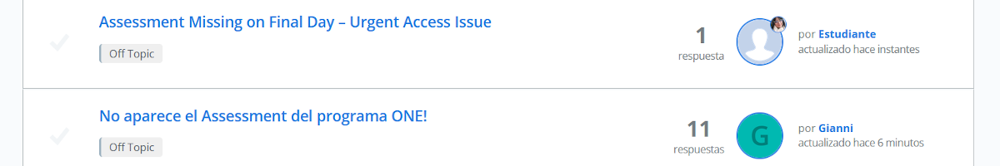
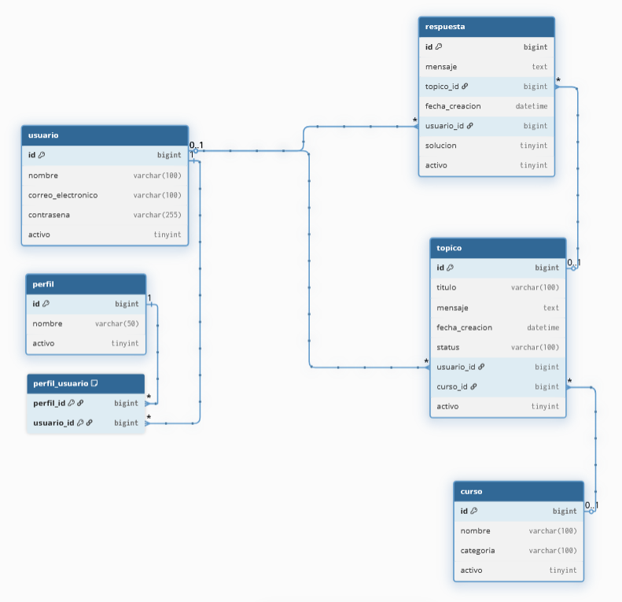

# Challenge 4 Foro Hub



 


## Introducción

El programa [Oracle Next Education (ONE)](https://www.oracle.com/latam/education/oracle-next-education/) es un programa de educación, inclusión y empleabilidad que forma a personas en tecnología y las conecta con el mercado laboral con el apoyo de empresas asociadas.

Es un programa gratuito que dura 12 meses. Abre inscripciones 2 veces al año donde las personas pueden postular mediante un formulario. Cada generación es enumerada con números arábigos.

El proyecto Foro Hub es el Challenge 4 del programa ONE de Oracle y Alura Latam del grupo G9 que inició en julio 2025. Es el tercer reto de desarrollo de la fase 3 (para estudiantes admitidos en el programa) y cuarto reto entre todas las fases después del aprendizaje de los cursos de Spring Boot 3 de desarrollo de un API REST, mejores prácticas, Seguridad, documentación, Testing e implementación.

El reto tiene como finalidad poner a prueba a los estudiantes en 4 puntos: programación Orientada a Objetos en Java con Spring Boot Framework, desarrollo de un API REST, conexión con MySQL, y uso de Git y GitHub.

## Descripción del proyecto

Foro Hub es un API REST para la creación, actualización, eliminación, listado y búsqueda de tópicos en un foro. Tienes a tu disposición 12 endpoints que cubren el CRUD de Tópico y 1 endpoint del inicio de sesión para obtener el token que da acceso al uso de los endpoints de Tópico.

## Estado del proyecto

El día 07 de marzo del 2026 se lanzó la versión 1 del proyecto siguiendo las indicaciones del video instructivo y tablero en Trello, ambos provistos por el programa ONE.

El proyecto se encuentra en su [versión 1.4](#registro-de-cambios).

## Demostración de funcionalidad

El proyecto tiene 7 funcionalidades programadas haciendo un total de 13 endpoints activos.

POST

1. `/login`: Inicio de sesión
2. `/topicos`: Registro de tópico

GET

1. `/topicos`: Lista de tópicos
2. `/topicos/curso/{nombreCurso}`: Consulta de tópicos por nombre de curso
3. `/topicos/anio/{anioCreacion}`: Consulta de tópicos por año de creación
4. `/topicos/curso/{nombreCurso}/anio/{anioCreacion}`: Consulta de tópicos por nombre de curso y año de creación
5. `/topicos/anio/{anioCreacion}/curso/{nombreCurso}`: Consulta de tópicos por año de creación y nombre de curso
6. `/topicos/{id}`: Consulta de tópico por id
7. `/topicos/`: Consulta de tópico por id, con validación del id como dato mandatorio

PUT

1. `/topicos/{id}`: Actualización de tópico por id
2. `/topicos/`: Actualización de tópico por id, con validación del id como dato mandatorio

DELETE

1. `/topicos/{id}`: Eliminación de tópico por id
2. `/topicos/`: Eliminación de tópico por id, con validación del id como dato mandatorio

El proyecto tiene implementada la documentación con la dependencia Springdoc, puedes verificar las especificaciones y funcionalidad de todos los endpoints en la ruta `/swagger-ui/index.html`.

## Tecnologías usadas

* JDK 17.0.13
* IntelliJ IDEA 2025.3.1
* [Spring Boot Framework 3.5.11](https://start.spring.io/)
* Dependencia spring-boot-starter-web de Maven
* Dependencia spring-boot-devtools de Maven
* Dependencia org.projectlombok de Maven
* Dependencia spring-boot-starter-data-jpa de Maven
* Dependencia spring-boot-starter-validation de Maven
* Dependencia flyway-core de Maven
* Dependencia flyway-mysql de Maven
* Dependencia mysql-connector-j de Maven
* Dependencia spring-boot-starter-security de Maven
* Dependencia java-jwt de Maven
* Dependencia springdoc-openapi-starter-webmvc-ui de Maven
* MySQL 8.0.45
* Git para control de versiones

## Estructura del proyecto

Para el proyecto se eligió usar la Estructura por Dominio.

```
src/main/java/com/pollorosa/forohub/
├── controller/
│   ├── AutenticacionController.java
│   └── TopicoController.java
├── domain/
│   ├── curso/
│   │   ├── Categoria.java
│   │   ├── Curso.java
│   │   ├── CursoRepository.java
│   │   └── DatosDetalleCurso.java
│   ├── topico/
│   │   ├── validaciones/
│   │   │   ├── ValidadorCursoExisteActivo.java
│   │   │   ├── ValidadorCursoExisteActivoParaActualizar.java
│   │   │   ├── ValidadorCursoExisteActivoParaBuscar.java
│   │   │   ├── ValidadorDeActualizacion.java
│   │   │   ├── ValidadorDeBusqueda.java
│   │   │   ├── ValidadorDeRegistro.java
│   │   │   ├── ValidadorDuplicidadTopicos.java
│   │   │   ├── ValidadorUsuarioActivo.java
│   │   │   └── ValidadorUsuarioActivoParaActualizar.java
│   │   ├── DatosDetalleTopico.java
│   │   ├── DatosListaTopico.java
│   │   ├── DatosRegistroTopico.java
│   │   ├── Respuesta.java
│   │   ├── Status.java
│   │   ├── Topico.java
│   │   ├── TopicoRepository.java
│   │   └── TopicoService.java
│   ├── usuario/
│   │   ├── AutenticacionService.java
│   │   ├── DatosAutenticacion.java
│   │   ├── DatosDetalleUsuario.java
│   │   ├── Perfil.java
│   │   ├── Usuario.java
│   │   └── UsuarioRepository.java
│   └── ValidacionException.java
├── infra/
│   ├── exceptions/
│   │   └── GestorDeExceptions.java
│   ├── security/
│   │   ├── DatosTokenJWT.java
│   │   ├── SecurityConfigurations.java
│   │   ├── SecurityFilter.java
│   │   └── TokenService.java
│   └── springdoc/
│       └── SpringDocConfiguration.java
└── ForohubApplication.java
```

## Base de datos

El proyecto utiliza una base de datos relacional MySQL con nombre `forohub`, se hace uso de los migrations de Flyway para la creación de las tablas.



Las propiedades del Datasource están almacenadas en variables de entorno usadas en el archivo `application.properties`.

## Seguridad

Se realizó la implementación de Spring Security para la autorización y autenticación basada en JWT (JSON Web Tokens).

La clave secreta está almacenada en una variable de entorno usada en el archivo `application.properties`.

Los endpoints de Tópico están protegidos, para el acceso se requiere un token válido en la cabecera de la solicitud. El token es provisto en el endpoint de inicio de sesión ingresando email y contraseña.

## Instalación local

1. Clonar el código fuente.

```
git clone https://github.com/PolloRosa/Challenge4-ForoHub.git
```

O descargar el proyecto haciendo click en el botón verde "Code" y haciendo click en la opción "Download ZIP".

2. Iniciar el IDE IntelliJ IDEA y abrir el proyecto.

3. Crear las variables del entorno `ALURA_DB_HOST`, `ALURA_DB_USER` y `ALURA_DB_PASSWORD`, y llenarlas con los datos correspondientes para la conexión con base de datos.

4. Iniciar sesión en la consola de MySQL o abrir el DBMS MySQL Workbench, y crear la base de datos `forohub`.

5. Ejecutar el proyecto desde la clase `ForohubApplication` para verificar la creación de las tablas por parte de Flyway y que el servidor web inicie.

## Registro de cambios

1.4.0 *18 marzo 2026*

* :pencil2: Actualiza el README.
* Agrega secciones Demostración de funcionalidad, Tecnologías usadas, Estructura del proyecto, Base de datos, Seguridad, Instalación local, Registro de cambios, Autor y Licencia en README.

1.3.0 *15 marzo 2026*

* :pencil2: Actualiza el README.
* Actualiza badges en la cabecera del README.

1.2.0 *10 marzo 2026*

* :sparkles: Agrega documentación con implementación de Springdoc.
* Agrega dependencia Springdoc en pom.xml.
* Crea la clase SpringDocConfiguration.
* Agrega anotación @SecurityRequirement en clase TopicoController.
* Agrega las rutas de Springdoc en clase SecurityConfigurations.

1.1.0 *08 marzo 2026*

* :sparkles: Agrega archivos de Licencia y README.
* Agrega secciones Introducción, Descripción y Estado en README.

1.0.0 *07 marzo 2026*

* :sparkles: Agrega capa de seguridad.
* Agrega dependencias en el pom.xml.
* Agrega la implementación de la interface UserDetails en la clase Entity Usuario.
* Agrega método para inicio de sesión en clase UsuarioRepository.
* Crea la clase AutenticacionService y agrega método para obtener información del usuario para el inicio de sesión.
* Crea la clase SecurityConfigurations para la configuración de la capa de seguridad.
* Crea la clase AutenticacionController para el inicio de sesión y la generación del Token.
* Crea la clase DTO DatosAutenticacion para recibir el email y contraseña.
* Crea la clase TokenService y agrega métodos para generar token y leer el token.
* Crea la clase DTO DatosTokenJWT para retornar el token.
* Agrega variables de entorno en application.properties.
* Crea la clase SecurityFilter para la autenticación.

0.7.0 *07 marzo 2026*

* :sparkles: Agrega endpoint para eliminación de Tópico por id.
* Agrega método para eliminación de Tópico por id en clase TopicoController.
* Agrega método para eliminación de Tópico por id en clase TopicoService.

0.6.0 *07 marzo 2026*

* :sparkles: Agrega endpoint para actualización de Tópico por id.
* Agrega método para actualización de Tópico por id en clase TopicoController.
* Agrega método para actualización de Tópico por id en clase TopicoService.
* Agrega método para validar la no duplicidad de títulos y mensajes para la actualización de Tópico por id en clase TopicoRepository.
* Agrega método para actualización de Tópico por id en clase Entity Topico.
* Crea la interface ValidadorDeActualizacion.
* Crea las clases ValidadorCursoExisteActivoParaActualizar y ValidadorUsuarioActivoParaActualizar para la validación de actualización de Tópico por id.

0.5.0 *07 marzo 2026*

* :pencil2: Corrección en el mensaje de error en la clase ValidadorUsuarioActivo.

0.4.0 *07 marzo 2026*

* :sparkles: Agrega endpoints para consulta de Tópico por id.
* Agrega método para consulta de Tópico por id en clase TopicoController.
* Agrega método para consulta de Tópico por id en clase TopicoService.
* :pencil2: Corrección en los DTOs de retorno de datos de Topico, Curso y Usuario para eliminar el campo id.
* :pencil2: Agrega ExceptionHandler para parámetros faltantes obligatorios en los métodos de todos los Controllers, en clase GestorDeExceptions.

0.3.0 *07 marzo 2026*

* :sparkles: Agrega endpoints para lista y búsqueda de Tópicos.
* Agrega método para lista y búsqueda de tópicos en clase TopicoController.
* Agrega método para lista y búsqueda de tópicos en clase TopicoService.
* Agrega método para lista y búsqueda de tópicos en clase TopicoRepository.
* Agrega la clase DTO DatosDetalleCurso.
  * Agrega la clase DTO DatosListaTopico.
* Agrega la clase DTO DatosDetalleUsuario.
* Crea la interface ValidadorDeBusqueda.
* Crea la clase ValidadorCursoExisteActivoParaBuscar para la validación de la búsqueda de tópicos por nombre de curso.
* :pencil2: Corrección en todas las clases Entity para corregir los nombres en la anotación @Entity.
* :pencil2: Agrega ExceptionHandler para conversión a números para parámetros numéricos en los métodos del Controller de Topico, en clase GestorDeExceptions.

0.2.0 *06 marzo 2026*

* :sparkles: Agrega endpoint de registro de Tópico con validación.
* Crea la clase TopicoController y agrega método para registro.
* Crea la clase TopicoService y agrega método para registro con las 3 validaciones indicadas según la Lógica de negocio.
* Crea la clase TopicoRepository y agrega método para validar títulos y mensajes únicos para el registro de tópicos.
* Crea la clase Entity Topico.
* Crea el Enum Status.
* Crea la clase Entity Usuario.
* Crea la clase Entity Curso.
* * Crea el Enum Categoria.
* Crea la clase Entity Respuesta.
* Crea la clase DTO DatosRegistroTopico.
* Crea la clase DTO DatosDetalleTopico.
* Crea la clase ValidacionException para dispararla como Excepción para las validaciones de registro.
* Crea la interface ValidadorDeRegistro.
* Crea las clases ValidadorCursoExisteActivo, ValidadorDuplicidadTopicos y ValidadorUsuarioActivo para la validación del registro de tópicos.
* :sparkles: Crea la clase CursoRepository. 
* :sparkles: Crea la clase Entity Perfil.
* :sparkles: Crea la clase UsuarioRepository.
* :sparkles: Crea la clase GestorDeExceptions.
* :pencil2: Agrega configuración para no devolver el stacktrace en application.properties.

0.1.0 *05 marzo 2026*

* :white_check_mark: Crea la base de datos con Flyway.
* Crea los archivos SQL con los scripts en la ruta src/main/resources/db/migration.
* Agrega application.properties con las variables para la conexión con base de datos.

## Autor

Angela Cáceres @PolloRosa :baby_chick:

## Licencia

El proyecto está bajo la licencia MIT. Puedes usarlo, compartirlo y modificarlo libremente, incluso con fines comerciales. La única condición es que conserves el aviso de derechos de autor original y el texto de la licencia en todas las copias o partes sustanciales del software.

Eres bienvenido/a de forkearlo y enviar tu PR.